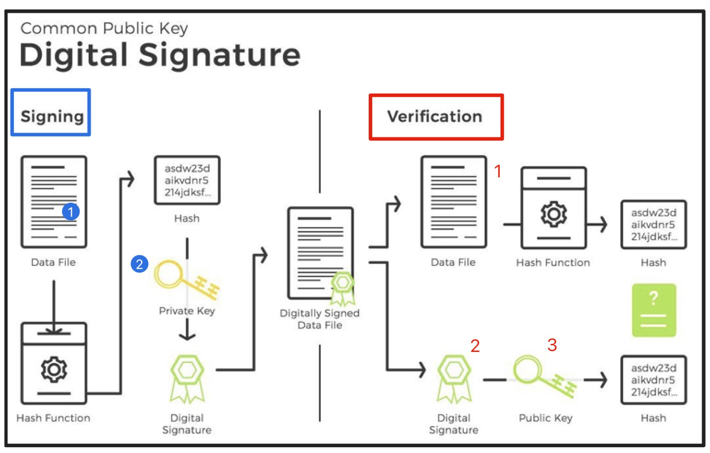
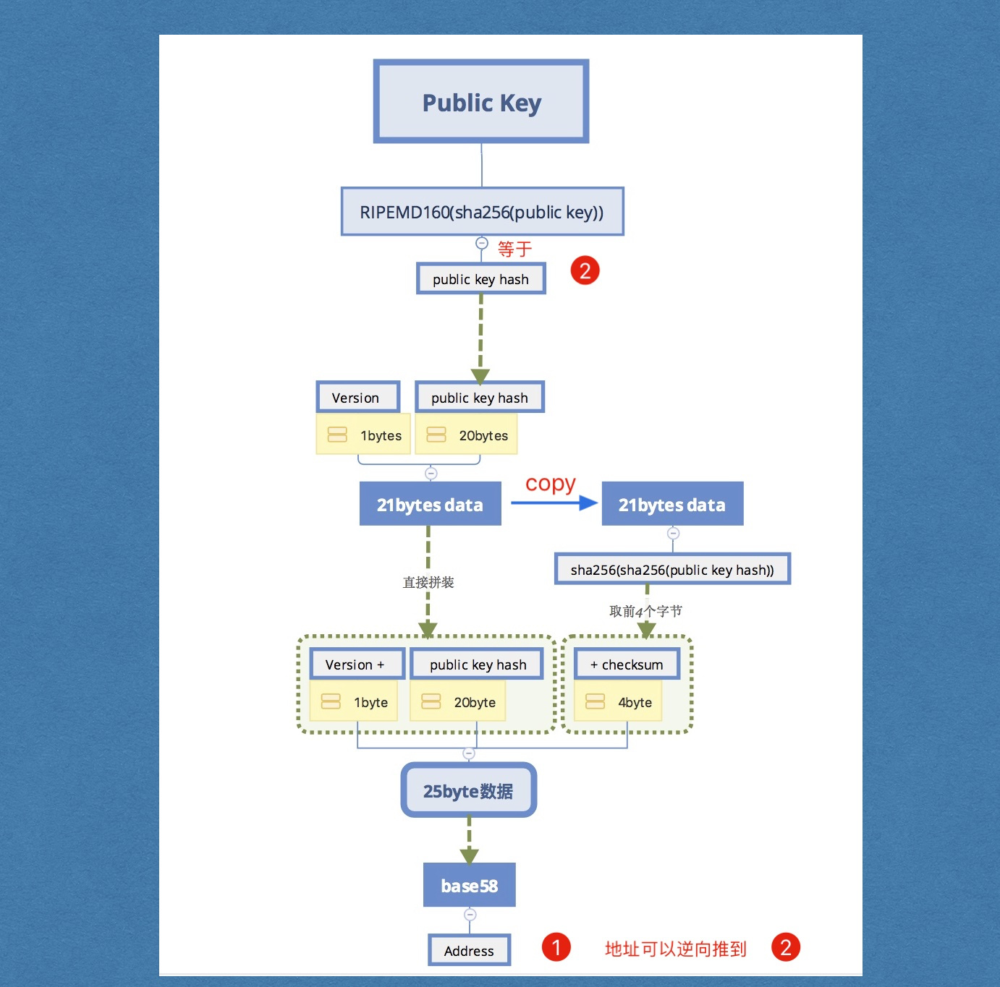
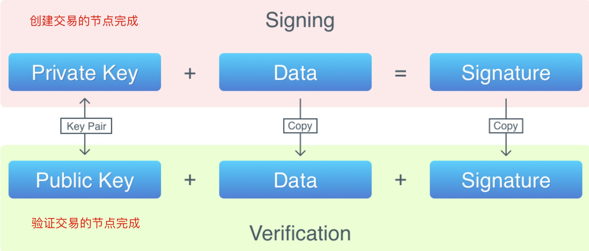

# 从0到1构建一条区块链----v5.0

## v4版本存在的问题

1. 地址是用字符串代替
2. 没有校验交易

## v5实现思路

1. 实现密钥对
2. 使用地址，公私钥改写代码
3. 交易签名
4. 交易校验

## 签名校验图示



比特币使用ECC（椭圆曲线）算法生成非对称加密对。

RSA-->比较常用的非对称加密算法

ECC-->比特币使用非对称加密算法

1. 非对称加密算法有RSA、ECDSA，对极大整数做因数分解的难度决定了RSA算法的可靠性，
2. ECDSA为椭圆曲线加密算法，是基于椭圆方程公式，所以安全性要高于RSA。
3. golang封装的`ecdsa`目前只有用私钥加密，公钥做校验，没有解密环节；所以目前可以应用于数字签名；

## 需要签名的内容

### - 签名需要什么？

- 想要签名的数据
- 私钥

### - 验证需要什么？

- 想要签名的数据
- 数字签名
- 公钥

## 公私钥关系以及如何生成地址




## 具体实现

### 创建地址

#### 定义Wallet结构wallet.go

```go
//这里的钱包是一个结构，每一个钱包保存了公钥私钥对
type Wallet struct {
	Private *ecdsa.PrivateKey
	//PubKey *ecdsa.PublicKey
	//这里的PubKey不存储原始的公钥，而是存储X，Y拼接的字符串，在校验端重新拆分（参考r，s传递）
	PubKey []byte
}
```

由于我们不想在交易中传递公钥本身，想传递[]byte，所以我们将公钥拆分成两个[]byte变量。

将他们append成一个[]byte后存放在公钥字段。

在verify之前一直把这个拼接的byte数组当成公钥。

在verifty时将它再拆成X, Y 两个big.Int 类型的数据，然后拼装成真实的公钥

#### 创建钱包wallet.go

```go
//创建钱包
func NewWallet() *Wallet {
	curve := elliptic.P256()
	//生成私钥
	privateKey, err := ecdsa.GenerateKey(curve, rand.Reader)
	if err != nil {
		log.Panic()
	}
	//生成公钥
	pubKeyOrigin := privateKey.PublicKey
	pubKey := append(pubKeyOrigin.X.Bytes(), pubKeyOrigin.Y.Bytes()...)
	return &Wallet{
		Private: privateKey,
		PubKey:  pubKey,
	}
}
```

#### 地址生成

- 通过公钥生成地址
- 对公钥进行哈希处理: RIPEMD160(sha256())
- 获取校验码: checksum()
- 拼接: version + hash + checksum
- 对公钥哈希做base58处理

```go
func HashPubKey(data []byte) []byte {
	hash := sha256.Sum256(data)
	rip160hasher := ripemd160.New()
	_, err := rip160hasher.Write(hash[:])
	if err != nil {
		log.Panic()
	}
	//返回rip160的hash结果
	rip160HashValue := rip160hasher.Sum(nil)
	return rip160HashValue
}

func CheckSum(data []byte) []byte {
	//两次sha256
	hash1 := sha256.Sum256(data)
	hash2 := sha256.Sum256(hash1[:])
	//前4字节校验码
	checkCode := hash2[:4]

	return checkCode
}
//生成地址
func (w *Wallet) NewAddress() string {
	pubKey := w.PubKey
	rip160HashValue := HashPubKey(pubKey)
	version := byte(00)
	//拼接version
	payload := append([]byte{version}, rip160HashValue...)
	//checksum
	checkCode := CheckSum(payload)
	//25字节数据
	payload = append(payload, checkCode...)
	//base58生成地址
	address := base58.Encode(payload)
	return address
}
```

### 持久化私钥对，保存到wallet.dat中

#### 定义钱包容器结构体wallets.go

```go
//定义一个Wallets结构，保存所有的wallet以及它的地址
type Wallets struct {
	WalletsMap map[string]*Wallet
}
```

#### 新建钱包容器方法wallets.go

```go
//创建方法
func NewWallets() *Wallets {
	var ws Wallets
	ws.WalletsMap = make(map[string]*Wallet)
	ws.LoadFile()
	return &ws
}
```

#### 存储到本地wallets.go

```go
//保存方法，把新建的wallet添加进去
func (ws *Wallets) SaveToFile() {
	var buffer bytes.Buffer
	gob.Register(elliptic.P256())
	encode := gob.NewEncoder(&buffer)
	err := encode.Encode(ws)
	if err != nil {
		log.Panic(err)
	}
	ioutil.WriteFile(walletFile, buffer.Bytes(), 0600)
}
```

#### 读取持久化的钱包文件方法wallets.go

```go
//读取文件方法，把所有的wallet读出来
func (ws *Wallets) LoadFile() {
	//读取之前确认文件是否存在
	_, err := os.Stat(walletFile)
	if os.IsNotExist(err) {
		//ws.WalletsMap = make(map[string]*Wallet)
		return
	}
	content, err := ioutil.ReadFile(walletFile)
	if err != nil {
		log.Panic(err)
	}
	gob.Register(elliptic.P256())
	//解码
	decoder := gob.NewDecoder(bytes.NewReader(content))
	var wsLocal Wallets
	err = decoder.Decode(&wsLocal)
	if err != nil {
		log.Panic(err)
	}
	ws.WalletsMap = wsLocal.WalletsMap
}
```


#### 新建钱包wallets.go

```go
func (ws *Wallets) CreateWallet() string {
	wallet := NewWallet()
	address := wallet.NewAddress()
	//wallets.WalletsMap = make(map[string]*Wallet)
	ws.WalletsMap[address] = wallet
	ws.SaveToFile()
	return address
}
```

#### 获取所有地址wallets.go

```go
func (ws *Wallets) ListAllAddresses() []string {
	var addresses []string
	for address := range ws.WalletsMap {
		addresses = append(addresses, address)
	}
	return addresses
}
```

### 修改交易结构transaction.go

#### 修改交易输入

```go
//定义交易输入
type TXInput struct {
	//引用的交易ID
	TXid []byte
	//引用的output的索引
	Index int64
	//解锁脚本,我们用地址来模拟
	//Sig string
	//真正的数字签名，由r，s拼接成的字节数组
	Signature []byte
	//这里的PubKey不存储原始的公钥，而是存储X，Y拼接的字符串，在校验端重新拆分（参考r，s传递）
	PubKey []byte
}
```

#### 修改交易输出

```go
//定义交易输出
type TXOutput struct {
	//转账金额
	Value float64
	//锁定脚本，我们用地址模拟
	//PubKeyHash string
	//收款方的公钥的hash
	PubKeyHash []byte
}
```

### 锁定脚本实现

#### 通过地址返回公钥hash wallets.go

```go
//通过地址返回公钥哈希
func GetPubKeyHashFromAddress(address string) []byte {
	//1.解码
	addressByte := base58.Decode(address) //25字节
	//2.截取出公钥hash，去除version--1字节，去除校验码--4字节
	pubKeyHash := addressByte[1 : len(addressByte)-4]
	return pubKeyHash
}
```

#### 锁定脚本transaction.go

```go
//由于现在存储的字段是地址的公钥hash，所以无法直接创建TXoutput
//为了能够得到公钥hash，我们需要处理一下，写一个Lock函数
func (output *TXOutput) Lock(address string) {
	pubKeyHash := GetPubKeyHashFromAddress(address)
	//真正的锁定动作
	output.PubKeyHash = pubKeyHash
}
```

### 创建TXOutput transaction.go

```go
//给TXOutput提供一个创建的方法，否则无法调用Lock
func NewTXOutput(value float64, address string) *TXOutput {
	output := TXOutput{
		Value: value,
	}
	output.Lock(address)
	return &output
}
```

### 重构对应代码

#### 更新NewCoinbaseTX transaction.go

```go
//2.创建交易
func NewTransaction(from, to string, amount float64, bc *BlockChain) *Transaction {
	//1.创建交易之后要进行数字签名，所以需要私钥->打开钱包(NewWallets())
	ws := NewWallets()
	//2.根据地址找到自己的wallet
	wallet := ws.WalletsMap[from]
	if wallet == nil {
		fmt.Println("没有找到该地址的钱包，交易创建失败!")
		return nil
	}
	//3.得到对应的公钥私钥
	pubKey := wallet.PubKey
	privateKey := wallet.Private
	//传递公钥的hash
	pubKeyHash := HashPubKey(pubKey)
	//1.找到最合理的UTXO集合 map[string]uint64
	utxos, resValue := bc.FindNeedUTXOS(pubKeyHash, amount)
	if resValue < amount {
		fmt.Println("余额不足，交易失败")
		return nil
	}

	var inputs []TXInput
	var outputs []TXOutput
	//2.将这些UTXO逐一转成inputs
	for id, indexArray := range utxos {
		for _, i := range indexArray {
			input := TXInput{[]byte(id), int64(i), nil, pubKey}
			inputs = append(inputs, input)
		}
	}
	//3.创建outputs
	//output := TXOutput{amount, to}
	output := NewTXOutput(amount, to)
	outputs = append(outputs, *output)
	//4.如果有零钱需要找零
	if resValue > amount {
		output = NewTXOutput(resValue-amount, from)
		outputs = append(outputs, *output)
	}

	tx := Transaction{[]byte{}, inputs, outputs}
	tx.SetHash()

	bc.SignTransaction(&tx, privateKey)
	return &tx
}
```

#### 更新NewTransaction transaction.go

```go
//2.创建交易
func NewTransaction(from, to string, amount float64, bc *BlockChain) *Transaction {
	//1.创建交易之后要进行数字签名，所以需要私钥->打开钱包(NewWallets())
	ws := NewWallets()
	//2.根据地址找到自己的wallet
	wallet := ws.WalletsMap[from]
	if wallet == nil {
		fmt.Println("没有找到该地址的钱包，交易创建失败!")
		return nil
	}
	//3.得到对应的公钥私钥
	pubKey := wallet.PubKey
	privateKey := wallet.Private
	//传递公钥的hash
	pubKeyHash := HashPubKey(pubKey)
	//1.找到最合理的UTXO集合 map[string]uint64
	utxos, resValue := bc.FindNeedUTXOS(pubKeyHash, amount)
	if resValue < amount {
		fmt.Println("余额不足，交易失败")
		return nil
	}

	var inputs []TXInput
	var outputs []TXOutput
	//2.将这些UTXO逐一转成inputs
	for id, indexArray := range utxos {
		for _, i := range indexArray {
			input := TXInput{[]byte(id), int64(i), nil, pubKey}
			inputs = append(inputs, input)
		}
	}
	//3.创建outputs
	//output := TXOutput{amount, to}
	output := NewTXOutput(amount, to)
	outputs = append(outputs, *output)
	//4.如果有零钱需要找零
	if resValue > amount {
		output = NewTXOutput(resValue-amount, from)
		outputs = append(outputs, *output)
	}

	tx := Transaction{[]byte{}, inputs, outputs}
	tx.SetHash()

	bc.SignTransaction(&tx, privateKey)
	return &tx
}
```

### 检验地址有效性wallet.go

```go
func IsValidAddress(address string) bool {
	//1.解码
	addressByte := base58.Decode(address)
	if len(addressByte) < 4 {
		return false
	}
	//2.截取数据
	payload := addressByte[:len(addressByte)-4]
	checkSum1 := addressByte[len(addressByte)-4:]
	//3.做checkSum函数
	checkSum2 := CheckSum(payload)
	//4.比较
	return bytes.Equal(checkSum1, checkSum2)
}
```

### 数字签名



#### 签哪些数据？

**所谓对交易签名**，就是对交易的哈希值签名，但是这个交易中要包含以下数据（注意，是包含以下内容，而不是仅限于以下信息）：

- 欲使用utxo中的pubKeyHash（这描述了付款人）
- 新生成utxo中的pubKeyHash（这描述了收款人）
- 转账金额

最后，把签好的数据放在每一个input的sig中

==由于每一笔交易都可能引用多个utxo（存在于多条交易中），所以我们要遍历所有的引用交易，并对它们逐个签名。==

查看浏览器交易签名

#### 在交易中签名

交易创建完成之后，在写入区块之前，我们要对其进行签名，这样对端才能够校验，从而保证系统的安全性。

为此我们需要在Transaction中添加签名(sign)和验证(verify)的方法。

#### Sign

==先把空函数写出来，Sign和SignTransaction，把关系交代清楚之后再进行内部实现==

签名需要下面两个数据：

- 想要签名的数据
- 私钥

==无论是签名还是校验，一定要格外注意处理挖矿交易==

##### transaction.go

```go
//签名的具体实现,参数为：私钥，inputs里面所有引用的交易的结构map[string]Transaction
//map[A] TransactionA
func (tx *Transaction) Sign(privateKey *ecdsa.PrivateKey, prevTXs map[string]Transaction) {
	//对coinbase交易不签名
	if tx.IsCoinbase() {
		return
	}
	//1.创建一个当期交易的副本:txCopy，使用函数:TrimmedCopy：要把Signature和PubKey字段设置为nil
	txCopy := tx.TrimmedCopy()
	//2.循环遍历txCopy的inputs，得到input所引用的output的公钥哈希
	for i, input := range txCopy.TXInputs {
		prevTX := prevTXs[string(input.TXid)]
		if len(prevTX.TXID) == 0 {
			log.Panic("引用的交易无效")
		}
		//不要对input进行赋值，这是一个副本，要对txCopy.TXInputs[i]进行操作
		txCopy.TXInputs[i].PubKey = prevTX.TXOutputs[input.Index].PubKeyHash
		//所需要的三个数据都具备了，开始做哈希处理
		//3.生成要签名的数据，要签名的数据一定是哈希值
		txCopy.SetHash()
		//还原，以免影响后面input的签名
		//a.我们对每一个input都要签名一次，签名数据是由当前input引用的output的哈希+当前的outputs（都在当前tx的副本里）
		//b.要对拼好的txCopy进行哈希处理，SetHash得到TXID，这个TXID就是我们要签名的最终数据
		txCopy.TXInputs[i].PubKey = nil
		signDataHash := txCopy.TXID
		//4.进行签名动作
		r, s, err := ecdsa.Sign(rand.Reader, privateKey, signDataHash)
		if err != nil {
			log.Panic(err)
		}
		signature := append(r.Bytes(), s.Bytes()...)
		//5.放到我们的input的Signature中
		txCopy.TXInputs[i].Signature = signature
	}

}

func (tx *Transaction) TrimmedCopy() Transaction {
	var inputs []TXInput
	var outputs []TXOutput
	for _, input := range tx.TXInputs {
		inputs = append(inputs, TXInput{input.TXid, input.Index, nil, nil})
	}

	for _, output := range tx.TXOutputs {
		outputs = append(outputs, output)
	}
	return Transaction{tx.TXID, inputs, outputs}
}
```

##### 根据交易id查找交易blockchain.go

```go
//根据id查找交易本身，需要遍历区块链
func (bc *BlockChain) FindTransactionByTXid(id []byte) (Transaction, error) {
   //1.遍历区块链
   it := bc.NewIterator()
   for {
      block := it.Next()
      //2.遍历交易
      for _, tx := range block.Transactions {
         //3.比较交易，找到了直接退出
         if bytes.Equal(tx.TXID, id) {
            return *tx, nil
         }
      }

      if len(block.PrevHash) == 0 {
         fmt.Printf("区块链遍历结束!\n")
         break
      }
   }
   //4.如果没找到，返回空Transaction同时返回错误状态
   return Transaction{}, errors.New("无效的交易id，请检查!")
}
```


##### 对交易进行签名blockchain.go

```go

func (bc *BlockChain) SignTransaction(tx *Transaction, privateKey *ecdsa.PrivateKey) {
	//签名，交易创建的最后进行签名
	prevTXs := make(map[string]Transaction)

	//找到所有引用的交易
	//1.根据inputs来找，有多少个input就遍历多少次
	//2.找到目标的交易，根据TXID来找
	//3.添加到prevTXs
	for _, input := range tx.TXInputs {
		//根据id查找交易本身，我们需要遍历整个区块链
		tx, err := bc.FindTransactionByTXid(input.TXid)
		if err != nil {
			log.Panic(err)
		}

		prevTXs[string(input.TXid)] = tx
	}

	tx.Sign(privateKey, prevTXs)
}
```

### 在挖矿时校验

当一笔交易发送到对端时，接收方在打包到自己的区块前，需要先对交易进行校验，从而保证

1. 持有者花费的确实是自己的钱
2. 交易确实是由私钥的持有者发起的

### - 分析

校验函数(Verify)依然在Transaction结构中实现，需要三个数据：

- 想要签名的数据
- 数字签名
- 公钥

代码如下：

校验函数原型如下，由于交易中已经存储了`数字签名`和`公钥`，所以只需要将引用的交易传递进来即可（为了获取引用输出的公钥哈希）

##### 验证单笔交易blockchain.go

```go
func (bc *BlockChain) VerifyTransaction(tx *Transaction) bool {
	if tx.IsCoinbase() {
		return true
	}
	//签名，交易创建的最后进行签名
	prevTXs := make(map[string]Transaction)

	//找到所有引用的交易
	//1.根据inputs来找，有多少个input就遍历多少次
	//2.找到目标的交易，根据TXID来找
	//3.添加到prevTXs
	for _, input := range tx.TXInputs {
		//根据id查找交易本身，我们需要遍历整个区块链
		tx, err := bc.FindTransactionByTXid(input.TXid)
		if err != nil {
			log.Panic(err)
		}

		prevTXs[string(input.TXid)] = tx
	}
	return tx.Verify(prevTXs)
}
```

##### 校验过程的实现transaction.go

```go
//分析校验过程
//所需要的数据：公钥、数据（txCopy、生成哈希）签名
//我们要对每一个签名过得input进行校验
func (tx *Transaction) Verify(prevTXs map[string]Transaction) bool {
	if tx.IsCoinbase() {
		return true
	}

	//1.得到签名数据
	txCopy := tx.TrimmedCopy()
	for i, input := range tx.TXInputs {
		prevTX := prevTXs[string(input.TXid)]
		if len(prevTX.TXID) == 0 {
			log.Panic("引用的交易无效")
		}
		txCopy.TXInputs[i].PubKey = prevTX.TXOutputs[input.Index].PubKeyHash
		txCopy.SetHash()
		dataHash := txCopy.TXID
		//2.得到Signature,反推r，s
		signature := input.Signature //r,s
		pubKey := input.PubKey       //拆x,y
		r := big.Int{}
		s := big.Int{}

		r.SetBytes(signature[:len(signature)/2])
		s.SetBytes(signature[len(signature)/2:])

		//3.拆解PubKey，得到x，y
		X := big.Int{}
		Y := big.Int{}

		X.SetBytes(pubKey[:len(pubKey)/2])
		Y.SetBytes(pubKey[len(pubKey)/2:])
		pubKeyOrigin := ecdsa.PublicKey{elliptic.P256(), &X, &Y}
		//4.Verify
		if !ecdsa.Verify(&pubKeyOrigin, dataHash, &r, &s) {
			return false
		}
	}
	return true
}

```

#### 更新AddBlock方法

```go
//6.添加区块
func (bc *BlockChain) AddBlock(txs []*Transaction) {
	for _, tx := range txs {
		if !bc.VerifyTransaction(tx) {
			fmt.Printf("矿工发现无效交易\n")
			return
		}
	}

	//区块链数据库
	db := bc.db
	//最后一个区块的hash
	lastHash := bc.tail
	db.Update(func(tx *bolt.Tx) error {
		//完成数据添加
		bucket := tx.Bucket([]byte(blockBucket))
		if bucket == nil {
			log.Panic("bucket不应该为空，请检查")
		}

		block := NewBlock(txs, lastHash)
		//更新区块链数据库--写区块
		bucket.Put(block.Hash, block.Serialize())
		bucket.Put([]byte(blockLastHashKey), block.Hash)
		//更新内存中的区块链
		bc.tail = block.Hash
		return nil
	})
}
```

## v5完成，进行测试main.go

```go
func main() {
	bc := NewBlockChain("18fh8wzXAzP9kE433CwNCQ34e4rjeDZgZN")
	cli := CLI{bc}
	cli.Run()
	//bc.AddBlock("第二个区块")
	//bc.AddBlock("第三个区块")

	//调用迭代器，返回每一个区块数据
	//it := bc.NewIterator()
	//for {
	//	//返回区块，左移
	//	block := it.Next()
	//	fmt.Println("===================================")
	//	fmt.Printf("前区块的hash值： %x\n", block.PrevHash)
	//	fmt.Printf("当前区块的hash值： %x\n", block.Hash)
	//	fmt.Printf("区块数据:  %s\n", block.Data)
	//
	//	if len(block.PrevHash) == 0 {
	//		fmt.Printf("区块遍历结束")
	//		break
	//	}
	//}
	bc.db.Close()
}

```

### 先不带参数运行go build .

```shell
开始挖矿......
挖矿成功!hash: 00000df4b1e20a3358ef6e9f3b9f0ce059b877f478f700960f3ec5ad7a347310 ,nonce: 1663493
```

### 新建钱包

```shell
newWallet

创建新的钱包....
地址: 17wFtBYsbdfC38QQz1fekFWiQxzyHYMJdx
```

### 查看所有地址

```shell
listAddresses

列举所有地址...
地址: 17wFtBYsbdfC38QQz1fekFWiQxzyHYMJdx
```

### 获取余额

```shell
getBalance --address 17wFtBYsbdfC38QQz1fekFWiQxzyHYMJdx
获取余额
这是Coinbase 不做input遍历
区块遍历完成退出
"17wFtBYsbdfC38QQz1fekFWiQxzyHYMJdx"的余额为: 0.000000

getBalance --address 18fh8wzXAzP9kE433CwNCQ34e4rjeDZgZN
获取余额
这是Coinbase 不做input遍历
区块遍历完成退出
"18fh8wzXAzP9kE433CwNCQ34e4rjeDZgZN"的余额为: 12.500000
```

### 转账

```shell
send 18fh8wzXAzP9kE433CwNCQ34e4rjeDZgZN 17wFtBYsbdfC38QQz1fekFWiQxzyHYMJdx 1.2 18fh8wzXAzP9kE433CwNCQ34e4rjeDZgZN "MyBlockChain"

转账开始
没有找到该地址的钱包，交易创建失败!
无效的交易

newWallet
创建新的钱包....
地址: 12EnGYQdSB8g5gcKcchWfAj9MQq11EZiDL

listAddresses
列举所有地址...
地址: 17wFtBYsbdfC38QQz1fekFWiQxzyHYMJdx
地址: 12EnGYQdSB8g5gcKcchWfAj9MQq11EZiDL

send 12EnGYQdSB8g5gcKcchWfAj9MQq11EZiDL 17wFtBYsbdfC38QQz1fekFWiQxzyHYMJdx 1 17wFtBYsbdfC38QQz1fekFWiQxzyHYMJdx "MyBlockChain"
转账开始
这是Coinbase 不做input遍历
区块遍历完成退出
余额不足，交易失败
无效的交易

send 12EnGYQdSB8g5gcKcchWfAj9MQq11EZiDL 17wFtBYsbdfC38QQz1fekFWiQxzyHYMJdx 0 17wFtBYsbdfC38QQz1fekFWiQxzyHYMJdx "MyBlockChain"
转账开始
这是Coinbase 不做input遍历
区块遍历完成退出
开始挖矿......
挖矿成功!hash: 0000015ddc62d48346687e958044ec3605f37ed63ea979ba0a1050ecb2da593a ,nonce: 119016
转账成功!

getBalance --address 17wFtBYsbdfC38QQz1fekFWiQxzyHYMJdx
获取余额
这是Coinbase 不做input遍历
这是Coinbase 不做input遍历
区块遍历完成退出
"17wFtBYsbdfC38QQz1fekFWiQxzyHYMJdx"的余额为: 12.500000
```

### 打印区块链

```shell
==================区块高度: 0 ====================
版本号: 0
前区块的hash值： 000000fe9e383885c8288e3e46d53bbf450368495b2c966d123546cf99fd097d
MerkelRoot: 46ccf1e4d395ce0cbbb80e3f006ab8412bd2d059e7a9f6b57aed7391d002e29b
时间戳: 2019-03-06 21:36:22
难度值: 0
随机数: 119016
当前区块的hash值： 0000015ddc62d48346687e958044ec3605f37ed63ea979ba0a1050ecb2da593a
区块数据:  MyBlockChain
==================区块高度: 1 ====================
版本号: 0
前区块的hash值：
MerkelRoot: 0d3c16e9cbde7aed7c4b72eb682a5fac9fefde2faf42fb38eee6d44a9af84cc6
时间戳: 2019-03-06 21:30:20
难度值: 0
随机数: 207453
当前区块的hash值： 000000fe9e383885c8288e3e46d53bbf450368495b2c966d123546cf99fd097d
区块数据:  创世区块
区块遍历结束
```

