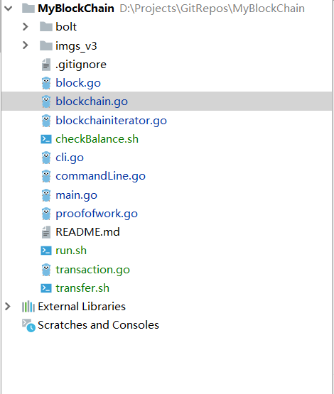
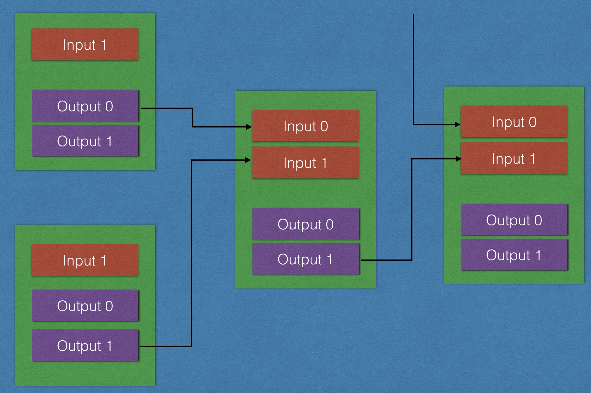

# 从0到1构建一条区块链----v4.0

## v3版本存在的问题

1. 并未实现真正的交易
2. 无激励机制
3. 无转账机制

## v4实现思路

1. 定义交易结构
2. 创建CoinBase（激励机制）
3. 代码重构
4. 查询指定地址余额
5. 转账实现
6. 命令模式更新

## 辅助：WIN10下如何执行sh脚本

[参考链接](https://blog.csdn.net/qq_41895190/article/details/82770309)

## 具体实现

### v4最终目录结构



### 交易结构相关transaction.go

#### 定义交易输入

```go
//定义交易输入
type TXInput struct {
	//引用的交易ID
	TXid []byte
	//引用的output的索引值
	Index int64
	//解锁脚本，我们用地址来模拟
	Sig string
}
```

#### 定义交易输出

```go
//定义交易输出
type TXOutput struct {
	//转账金额
	Value float64
	//锁定脚本,我们用地址模拟
	PubKeyHash string
}
```

#### 定义交易结构

```go
//1. 定义交易结构
type Transaction struct {
	TXID      []byte     //交易ID
	TXInputs  []TXInput  //交易输入数组
	TXOutputs []TXOutput //交易输出的数组
}
```

#### 设置交易ID，为hash值

```go
//设置交易ID
func (tx *Transaction) SetHash() {
	var buffer bytes.Buffer

	encoder := gob.NewEncoder(&buffer)

	err := encoder.Encode(tx)
	if err != nil {
		log.Panic(err)
	}

	data := buffer.Bytes()
	hash := sha256.Sum256(data)
	tx.TXID = hash[:]
}
```

### Coinbase交易方法实现（激励机制）transaction.go

设置挖矿奖励金额:

```go
const reward = 50
```

```go
//2. 提供创建交易方法(挖矿交易)
func NewCoinbaseTX(address string, data string) *Transaction {
	//挖矿交易的特点：
	//1. 只有一个input
	//2. 无需引用交易id
	//3. 无需引用index
	//矿工由于挖矿时无需指定签名，所以这个sig字段可以由矿工自由填写数据，一般是填写矿池的名字
	input := TXInput{[]byte{}, -1, data}
	output := TXOutput{reward, address}

	//对于挖矿交易来说，只有一个input和一output
	tx := Transaction{[]byte{}, []TXInput{input}, []TXOutput{output}}
	tx.SetHash()

	return &tx
}
```

### 判断一个交易是否是Coinbase交易方法的实现transaction.go

```go
//实现一个函数，判断当前的交易是否为挖矿交易
func (tx *Transaction) IsCoinbase() bool {
	//1. 交易input只有一个
	//if len(tx.TXInputs) == 1  {
	//	input := tx.TXInputs[0]
	//	//2. 交易id为空
	//	//3. 交易的index 为 -1
	//	if !bytes.Equal(input.TXid, []byte{}) || input.Index != -1 {
	//		return false
	//	}
	//}
	//return true

	if len(tx.TXInputs) == 1 && len(tx.TXInputs[0].TXid) == 0 && tx.TXInputs[0].Index == -1 {
		return true
	}

	return false
}
```


### MerkelRoot生成方法block.go

```go
//模拟梅克尔根，只是对交易的数据做简单的拼接，而不做二叉树处理！
func (block *Block) MakeMerkelRoot() []byte {
	var info []byte
	//var finalInfo [][]byte
	for _, tx := range block.Transactions {
		//将交易的哈希值拼接起来，再整体做哈希处理
		info = append(info, tx.TXID...)
		//finalInfo = [][]byte{tx.TXID}
	}

	hash := sha256.Sum256(info)
	return hash[:]
}
```


### 重构代码

#### 重构Block结构体block.go

```go
//0. 定义结构
type Block struct {
	//1.版本号
	Version uint64
	//2. 前区块哈希
	PrevHash []byte
	//3. Merkel根（梅克尔根，这就是一个哈希值，我们先不管，我们后面v4再介绍）
	MerkelRoot []byte
	//4. 时间戳
	TimeStamp uint64
	//5. 难度值
	Difficulty uint64
	//6. 随机数，也就是挖矿要找的数据
	Nonce uint64

	//a. 当前区块哈希,正常比特币区块中没有当前区块的哈希，我们为了是方便做了简化！
	Hash []byte
	//b. 数据
	//Data []byte
	//真实的交易数组
	Transactions []*Transaction
}
```

#### 重构NewBlock方法block.go

```go
//2. 创建区块
func NewBlock(txs []*Transaction, prevBlockHash []byte) *Block {
	block := Block{
		Version:    00,
		PrevHash:   prevBlockHash,
		MerkelRoot: []byte{},
		TimeStamp:  uint64(time.Now().Unix()),
		Difficulty: 0, //随便填写的无效值
		Nonce:      0, //同上
		Hash:       []byte{},
		//Data:       []byte(data),
		Transactions: txs,
	}

	block.MerkelRoot = block.MakeMerkelRoot()

	//block.SetHash()
	//创建一个pow对象
	pow := NewProofOfWork(&block)
	//查找随机数，不停的进行哈希运算
	hash, nonce := pow.Run()

	//根据挖矿结果对区块数据进行更新（补充）
	block.Hash = hash
	block.Nonce = nonce

	return &block
}
```

#### 重构NewBlockChain方法blockchain.go

删掉以往的CreateBlockChain方法

```go
//5. 定义一个区块链
func NewBlockChain(address string) *BlockChain {
	//return &BlockChain{
	//	blocks: []*Block{genesisBlock},
	//}

	//最后一个区块的哈希， 从数据库中读出来的
	var lastHash []byte

	//1. 打开数据库
	db, err := bolt.Open(blockChainDb, 0600, nil)
	//defer db.Close()

	if err != nil {
		log.Panic("打开数据库失败！")
	}

	//将要操作数据库（改写）
	db.Update(func(tx *bolt.Tx) error {
		//2. 找到抽屉bucket(如果没有，就创建）
		bucket := tx.Bucket([]byte(blockBucket))
		if bucket == nil {
			//没有抽屉，我们需要创建
			bucket, err = tx.CreateBucket([]byte(blockBucket))
			if err != nil {
				log.Panic("创建bucket(b1)失败")
			}

			//创建一个创世块，并作为第一个区块添加到区块链中
			genesisBlock := GenesisBlock(address)
			//fmt.Printf("genesisBlock :%s\n", genesisBlock)

			//3. 写数据
			//hash作为key， block的字节流作为value，尚未实现
			bucket.Put(genesisBlock.Hash, genesisBlock.Serialize())
			bucket.Put([]byte("LastHashKey"), genesisBlock.Hash)
			lastHash = genesisBlock.Hash

			////这是为了读数据测试，马上删掉,套路!
			//blockBytes := bucket.Get(genesisBlock.Hash)
			//block := Deserialize(blockBytes)
			//fmt.Printf("block info : %s\n", block)

		} else {
			lastHash = bucket.Get([]byte("LastHashKey"))
		}

		return nil
	})

	return &BlockChain{db, lastHash}
}
```

#### 重构AddBlock方法blockchain.go

```go
//5. 添加区块
func (bc *BlockChain) AddBlock(txs []*Transaction) {
	//如何获取前区块的哈希呢？？
	db := bc.db         //区块链数据库
	lastHash := bc.tail //最后一个区块的哈希

	db.Update(func(tx *bolt.Tx) error {

		//完成数据添加
		bucket := tx.Bucket([]byte(blockBucket))
		if bucket == nil {
			log.Panic("bucket 不应该为空，请检查!")
		}

		//a. 创建新的区块
		block := NewBlock(txs, lastHash)

		//b. 添加到区块链db中
		//hash作为key， block的字节流作为value，尚未实现
		bucket.Put(block.Hash, block.Serialize())
		bucket.Put([]byte("LastHashKey"), block.Hash)

		//c. 更新一下内存中的区块链，指的是把最后的小尾巴tail更新一下
		bc.tail = block.Hash

		return nil
	})
}
```

### ***交易真正的实现blockchain.go



#### 找到指定地址的UTXO的交易集合

我们的比特币都在UTXO中，UTXO又包含在交易中，所以如果想知道我们可以支配的UTXO，必须找到这些UTXO所在的交易，每个人有N个UTXO，所以我们需要找到所有的交易，也就是说，应该找到包含UTXO的交易的集合。

##### 找到指定地址的UTXO的交易的集合

```go
func (bc *BlockChain) FindUTXOTransactions(address string) []*Transaction {
	var txs []*Transaction //存储所有包含utxo交易集合
	//我们定义一个map来保存消费过的output，key是这个output的交易id，value是这个交易中索引的数组
	//map[交易id][]int64
	spentOutputs := make(map[string][]int64)

	//创建迭代器
	it := bc.NewIterator()

	for {
		//1.遍历区块
		block := it.Next()

		//2. 遍历交易
		for _, tx := range block.Transactions {
			//fmt.Printf("current txid : %x\n", tx.TXID)

		OUTPUT:
		//3. 遍历output，找到和自己相关的utxo(在添加output之前检查一下是否已经消耗过)
		//	i : 0, 1, 2, 3
			for i, output := range tx.TXOutputs {
				//fmt.Printf("current index : %d\n", i)
				//在这里做一个过滤，将所有消耗过的outputs和当前的所即将添加output对比一下
				//如果相同，则跳过，否则添加
				//如果当前的交易id存在于我们已经表示的map，那么说明这个交易里面有消耗过的output

				//map[2222] = []int64{0}
				//map[3333] = []int64{0, 1}
				//这个交易里面有我们消耗过得output，我们要定位它，然后过滤掉
				if spentOutputs[string(tx.TXID)] != nil {
					for _, j := range spentOutputs[string(tx.TXID)] {
						//[]int64{0, 1} , j : 0, 1
						if int64(i) == j {
							//fmt.Printf("111111")
							//当前准备添加output已经消耗过了，不要再加了
							continue OUTPUT
						}
					}
				}

				//这个output和我们目标的地址相同，满足条件，加到返回UTXO数组中
				if output.PubKeyHash == address {
					//fmt.Printf("222222")
					//UTXO = append(UTXO, output)

					//!!!!!重点
					//返回所有包含我的outx的交易的集合
					txs = append(txs, tx)

					//fmt.Printf("333333 : %f\n", UTXO[0].Value)
				} else {
					//fmt.Printf("333333")
				}
			}

			//如果当前交易是挖矿交易的话，那么不做遍历，直接跳过

			if !tx.IsCoinbase() {
				//4. 遍历input，找到自己花费过的utxo的集合(把自己消耗过的标示出来)
				for _, input := range tx.TXInputs {
					//判断一下当前这个input和目标（李四）是否一致，如果相同，说明这个是李四消耗过的output,就加进来
					if input.Sig == address {
						//spentOutputs := make(map[string][]int64)
						//indexArray := spentOutputs[string(input.TXid)]
						//indexArray = append(indexArray, input.Index)
						spentOutputs[string(input.TXid)] = append(spentOutputs[string(input.TXid)], input.Index)
						//map[2222] = []int64{0}
						//map[3333] = []int64{0, 1}
					}
				}
			} else {
				//fmt.Printf("这是coinbase，不做input遍历！")
			}
		}

		if len(block.PrevHash) == 0 {
			break
			fmt.Printf("区块遍历完成退出!")
		}
	}

	return txs
}
```


```go
//找到指定地址的所有的utxo
func (bc *BlockChain) FindUTXOs(address string) []TXOutput {
	var UTXO []TXOutput

	txs := bc.FindUTXOTransactions(address)

	for _, tx := range txs {
		for _, output := range tx.TXOutputs {
			if address == output.PubKeyHash {
				UTXO = append(UTXO, output)
			}
		}
	}

	return UTXO
}
```

#### 找到指定地址所需金额的UTXO的集合，同时将这些UTXO总额一并返回

```go
//根据需求找到合理的utxo
func (bc *BlockChain) FindNeedUTXOs(from string, amount float64) (map[string][]uint64, float64) {
	//找到的合理的utxos集合
	utxos := make(map[string][]uint64)
	var calc float64

	txs := bc.FindUTXOTransactions(from)

	for _, tx := range txs {
		for i, output := range tx.TXOutputs {
			if from == output.PubKeyHash {

				utxos[string(tx.TXID)] = append(utxos[string(tx.TXID)], uint64(i))
				calc += output.Value

				if calc >= amount {
					//break
					fmt.Printf("找到了满足的金额：%f\n", calc)
					return utxos, calc
				}
			} else {
				fmt.Printf("不满足转账金额,当前总额：%f， 目标金额: %f\n", calc, amount)
			}
		}
	}

	return utxos, calc
}
```

### 创建普通交易的方法实现

```go
func NewTransaction(from, to string, amount float64, bc *BlockChain) *Transaction {

	//1. 找到最合理UTXO集合 map[string][]uint64
	utxos, resValue := bc.FindNeedUTXOs(from, amount)

	if resValue < amount {
		fmt.Printf("余额不足，交易失败!")
		return nil
	}

	var inputs []TXInput
	var outputs []TXOutput

	//2. 创建交易输入, 将这些UTXO逐一转成inputs
	//map[2222] = []int64{0}
	//map[3333] = []int64{0, 1}
	for id, indexArray := range utxos {
		for _, i := range indexArray {
			input := TXInput{[]byte(id), int64(i), from}
			inputs = append(inputs, input)
		}
	}

	//创建交易输出
	output := TXOutput{amount, to}
	outputs = append(outputs, output)

	//找零
	if resValue > amount {
		outputs = append(outputs, TXOutput{resValue - amount, from})
	}

	tx := Transaction{[]byte{}, inputs, outputs}
	tx.SetHash()
	return &tx
}
```

### 命令行代码重构

#### cli.go

```go
//这是一个用来接收命令行参数并且控制区块链操作的文件

type CLI struct {
	bc *BlockChain
}

const Usage = `
	printChain               "正向打印区块链"
	printChainR              "反向打印区块链"
	getBalance --address ADDRESS "获取指定地址的余额"
	send FROM TO AMOUNT MINER DATA "由FROM转AMOUNT给TO，由MINER挖矿，同时写入DATA"
`

//接受参数的动作，我们放到一个函数中

func (cli *CLI) Run() {

	//./block printChain
	//./block addBlock --data "HelloWorld"
	//1. 得到所有的命令
	args := os.Args
	if len(args) < 2 {
		fmt.Printf(Usage)
		return
	}

	//2. 分析命令
	cmd := args[1]
	switch cmd {
	case "printChain":
		fmt.Printf("正向打印区块\n")
		cli.PrinBlockChain()
	case "printChainR":
		fmt.Printf("反向打印区块\n")
		cli.PrinBlockChainReverse()
	case "getBalance":
		fmt.Printf("获取余额\n")
		if len(args) == 4 && args[2] == "--address" {
			address := args[3]
			cli.GetBalance(address)
		}
	case "send":
		fmt.Printf("转账开始...\n")
		if len(args) != 7 {
			fmt.Printf("参数个数错误，请检查！\n")
			fmt.Printf(Usage)
			return
		}
		//./block send FROM TO AMOUNT MINER DATA "由FROM转AMOUNT给TO，由MINER挖矿，同时写入DATA"
		from := args[2]
		to := args[3]
		amount, _ := strconv.ParseFloat(args[4], 64) //知识点，请注意
		miner := args[5]
		data := args[6]
		cli.Send(from, to, amount, miner, data)
	default:
		fmt.Printf("无效的命令，请检查!\n")
		fmt.Printf(Usage)
	}
}

```

#### commandLine.go

```go
//正向打印
func (cli *CLI) PrinBlockChain() {
	cli.bc.Printchain()
	fmt.Printf("打印区块链完成\n")
}

//反向打印
func (cli *CLI) PrinBlockChainReverse() {
	bc := cli.bc
	//创建迭代器
	it := bc.NewIterator()

	//调用迭代器，返回我们的每一个区块数据
	for {
		//返回区块，左移
		block := it.Next()

		fmt.Printf("===========================\n\n")
		fmt.Printf("版本号: %d\n", block.Version)
		fmt.Printf("前区块哈希值: %x\n", block.PrevHash)
		fmt.Printf("梅克尔根: %x\n", block.MerkelRoot)
		timeFormat := time.Unix(int64(block.TimeStamp), 0).Format("2006-01-02 15:04:05")
		fmt.Printf("时间戳: %s\n", timeFormat)
		fmt.Printf("难度值(随便写的）: %d\n", block.Difficulty)
		fmt.Printf("随机数 : %d\n", block.Nonce)
		fmt.Printf("当前区块哈希值: %x\n", block.Hash)
		fmt.Printf("区块数据 :%s\n", block.Transactions[0].TXInputs[0].Sig)

		if len(block.PrevHash) == 0 {
			fmt.Printf("区块链遍历结束！")
			break
		}
	}
}

func (cli *CLI) GetBalance(address string) {

	utxos := cli.bc.FindUTXOs(address)

	total := 0.0
	for _, utxo := range utxos {
		total += utxo.Value
	}

	fmt.Printf("\"%s\"的余额为：%f\n", address, total)
}

func (cli *CLI) Send(from, to string, amount float64, miner, data string) {
	//fmt.Printf("from : %s\n", from)
	//fmt.Printf("to : %s\n", to)
	//fmt.Printf("amount : %f\n", amount)
	//fmt.Printf("miner : %s\n", miner)
	//fmt.Printf("data : %s\n", data)

	//1. 创建挖矿交易
	coinbase := NewCoinbaseTX(miner, data)

	txs := []*Transaction{coinbase}

	//2. 创建一个普通交易
	tx := NewTransaction(from, to, amount, cli.bc)
	if tx != nil {
		txs = append(txs, tx)
	} else {
		fmt.Printf("发现无效的交易!\n")
	}

	//3. 添加到区块
	cli.bc.AddBlock(txs)
	fmt.Printf("转账成功！")
}

```

## v4版本完成，进行测试main.go

```shell
func main() {
	bc := NewBlockChain("sher")
	cli := CLI{bc}
	cli.Run()
}
```

#### 先不带参数运行一次创建区块链

```shell
开始挖矿...
挖矿成功！hash : 00000f82ba116f07985e568eb39928096b003eb85bf29aea906689a367a83f48, nonce : 134340
```

#### 查询余额

```shell
getBalance --address sher

获取余额
"sher"的余额为：50.000000
```

#### 转账测试

```shell
send sher lin 5 sher "MyCoinbase"

转账开始...
找到了满足的金额：50.000000
开始挖矿...
挖矿成功！hash : 00000be134f3421ba301000686b388dce3e8704c9a4e88804e1254b17f62f62f, nonce : 443064
转账成功！
```

#### 查询lin和sher这两个账户的余额

```shell
getBalance --address sher
获取余额
"sher"的余额为：95.000000

getBalance --address lin
获取余额
"lin"的余额为：5.000000
```

#### 打印区块链

```shell
printChain

正向打印区块
=============== 区块高度: 0 ==============
版本号: 0
前区块哈希值:
梅克尔根: 1f221bc75b0c128e862b2379479c9664e362c2a1a6513de80088179b75cb4995
时间戳: 1551874835
难度值: 0
随机数 : 761036
当前区块哈希值: 0000072120edcdc166a81b302c2cd71ded949e1aab0fce412ace627ddab72dac
区块数据 :I'm genesis!
=============== 区块高度: 1 ==============
版本号: 0
前区块哈希值: 0000072120edcdc166a81b302c2cd71ded949e1aab0fce412ace627ddab72dac
梅克尔根: 7bb8f3d916ea5f47c7c9d01ad5e8aad9699a61f721030c9a99c76ce18ff6bb29
时间戳: 1551874883
难度值: 0
随机数 : 443064
当前区块哈希值: 00000be134f3421ba301000686b388dce3e8704c9a4e88804e1254b17f62f62f
区块数据 :MyCoinbase
打印区块链完成
```


