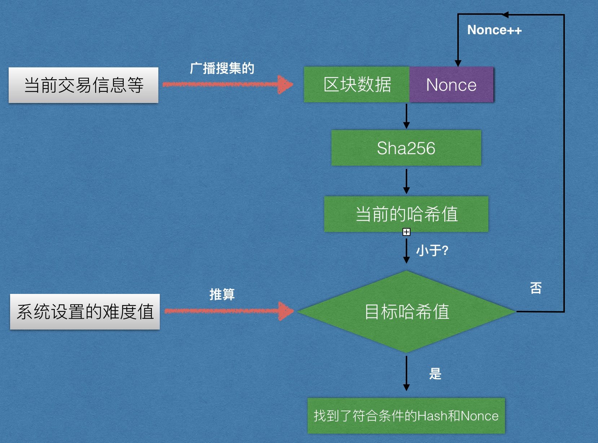
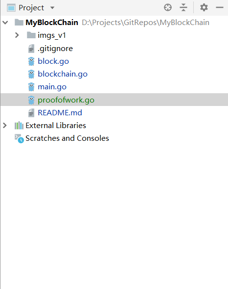

# 从0到1构建一条区块链----v2.0

## v1版本存在的问题

1. 随机数的生成
2. 难度值的生产
3. 尚未实现POW

## v2实现思路

1. POW结构体定义
2. 新建POW
3. 挖矿实现
4. POW校验函数

## 具体实现

### POW介绍



### v2最终目录结构



### 定义POW结构体proofofwork.go

```go
//定义一个工作量证明的结构ProofOfWork
type ProofOfWork struct {
	//1. block
	block *Block
	//2. 目标值
	//采用big.Int数据结构
	target *big.Int
}
```

### 新建POW函数proofofwork.go

难度值我们先给一个定值:

```go
//2. 提供创建POW的函数
func NewProofOfWork(block *Block) *ProofOfWork {
	pow := ProofOfWork{
		block: block,
	}

	//我们指定的难度值，现在是一个string类型，需要进行转换
	targetStr := "0000100000000000000000000000000000000000000000000000000000000000"
	//
	//引入的辅助变量，目的是将上面的难度值转成big.int
	tmpInt := big.Int{}
	//将难度值赋值给big.int，指定16进制的格式
	tmpInt.SetString(targetStr, 16)

	pow.target = &tmpInt
	return &pow
}
```

### 挖矿以及校验实现proofofwork.go

所谓的挖矿，其实就是根据随机数+区块数据不断的计算hash值，以达到hash值低于难度值的要求才能满足区块打包的要求，所以我们先需要一个辅助函数能把所有的区块数据拼接起来。

```go
func (pow *ProofOfWork) PrepareData(nonce uint64) []byte {
	block := pow.block
	tmp := [][]byte{
		Uint64ToByte(block.Version),
		block.PrevHash,
		block.MerkelRoot,
		Uint64ToByte(block.TimeStamp),
		Uint64ToByte(block.Difficulty),
		Uint64ToByte(nonce),
		block.Data,
	}

	//将二维的切片数组链接起来，返回一个一维的切片
	blockInfo := bytes.Join(tmp, []byte{})
	return blockInfo
}
```


```go
//3. 提供计算不断计算hash的哈数
func (pow *ProofOfWork) Run() ([]byte, uint64) {
	//1. 拼装数据（区块的数据，还有不断变化的随机数）
	//2. 做哈希运算
	//3. 与pow中的target进行比较
		//a. 找到了，退出返回
		//b. 没找到，继续找，随机数加1（这里可以改进）

	var nonce uint64
	//block := pow.block
	var hash [32]byte

	for {

		fmt.Printf("hash : %x\r", hash)

		//1. 拼装数据（区块的数据，还有不断变化的随机数）
		blockInfo := pow.PrepareData(nonce)
		//2. 做哈希运算
		//func Sum256(data []byte) [Size]byte
		hash = sha256.Sum256(blockInfo)
		//3. 与pow中的target进行比较
		tmpInt := big.Int{}
		//将我们得到hash数组转换成一个big.int
		tmpInt.SetBytes(hash[:])

		//比较当前的哈希与目标哈希值，如果当前的哈希值小于目标的哈希值，就说明找到了，否则继续找

		//   -1 if x <  y
		//    0 if x == y
		//   +1 if x >  y
		//
		//func (x *Int) Cmp(y *Int) (r int) {
		if tmpInt.Cmp(pow.target) == -1 {
			//a. 找到了，退出返回
			fmt.Printf("挖矿成功！hash : %x, nonce : %d\n", hash, nonce)
			//break
			return hash[:], nonce
		} else {
			//b. 没找到，继续找，随机数加1
			nonce++
		}
	}
}
```

### 调用POW block.go

我们原先实现区块hash的生成采用的是一个SetHash函数，而我们现在已经实现了POW，所以首先需要将SetHash函数注释掉。

```go
//2. 创建区块
func NewBlock(data string, prevBlockHash []byte) *Block {
	block := Block{
		Version:    00,
		PrevHash:   prevBlockHash,
		MerkelRoot: []byte{},
		TimeStamp:  uint64(time.Now().Unix()),
		Difficulty: 0, //随便填写的无效值
		Nonce:      0, //同上
		Hash:       []byte{},
		Data:       []byte(data),
	}

	//block.SetHash()
	//创建一个pow对象
	pow := NewProofOfWork(&block)
	//查找随机数，不停的进行哈希运算
	hash, nonce := pow.Run()

	//根据挖矿结果对区块数据进行更新（补充）
	block.Hash = hash
	block.Nonce = nonce

	return &block
}
```

### 难度值动态生成 proofofwork.go

我们需要改造新建POW函数

```go
//2. 提供创建POW的函数
func NewProofOfWork(block *Block) *ProofOfWork {
	pow := ProofOfWork{
		block: block,
	}

	//hashString := "0001000000000000000000000000000000000000000000000000000000000000"
	//tmp := big.Int{}
	//tmp.SetString(hashString, 16)

	//pow.target = &tmp

	//目标值：
	// 0001000000000000000000000000000000000000000000000000000000000000
	//初始值
	// 0000000000000000000000000000000000000000000000000000000000000001
	//左移256位
	//10000000000000000000000000000000000000000000000000000000000000000
	//右移4位(16进制位数)
	// 0001000000000000000000000000000000000000000000000000000000000000

	targetLocal := big.NewInt(1)
	//targetLocal.Lsh(targetLocal, 256)
	//targetLocal.Rsh(targetLocal, difficulty)
    //将难度给一个定值（可改进）
	var difficulty uint
	difficulty = 4
	targetLocal.Lsh(targetLocal, 256-difficulty)
	pow.target = targetLocal

	return &pow
}
```


### v2版本已完成，进行测试main.go

```go
func main() {
	bc := NewBlockChain()
	bc.AddBlock("A向B转账1BTC")
	bc.AddBlock("A向B转账3BTC")

	for i, block := range bc.blocks {
		fmt.Printf("======== 当前区块高度： %d ========\n", i)
		fmt.Printf("前区块哈希值： %x\n", block.PrevHash)
		fmt.Printf("当前区块哈希值： %x\n", block.Hash)
		fmt.Printf("区块数据 :%s\n", block.Data)
	}
}
```

### 测试结果

```go
挖矿成功！hash : 0fcc0b5cde8dd0128c8ebd5158071d0edc01a6b92379ee437e2df2c9265252d6, nonce : 24
挖矿成功！hash : 0b55e4e088cd87193cd9de38487ff2c23fe6bdb2361454fa6a13f804aad033e1, nonce : 6
挖矿成功！hash : 0c5253d12968d3503177f7605b277ef824b3934cce910e1bdbf61dd5ae4374f4, nonce : 2
======== 当前区块高度： 0 ========
前区块哈希值：
当前区块哈希值： 0fcc0b5cde8dd0128c8ebd5158071d0edc01a6b92379ee437e2df2c9265252d6
区块数据 :I'm genesis!
======== 当前区块高度： 1 ========
前区块哈希值： 0fcc0b5cde8dd0128c8ebd5158071d0edc01a6b92379ee437e2df2c9265252d6
当前区块哈希值： 0b55e4e088cd87193cd9de38487ff2c23fe6bdb2361454fa6a13f804aad033e1
区块数据 :A向B转账1BTC
======== 当前区块高度： 2 ========
前区块哈希值： 0b55e4e088cd87193cd9de38487ff2c23fe6bdb2361454fa6a13f804aad033e1
当前区块哈希值： 0c5253d12968d3503177f7605b277ef824b3934cce910e1bdbf61dd5ae4374f4
区块数据 :A向B转账3BTC
```

