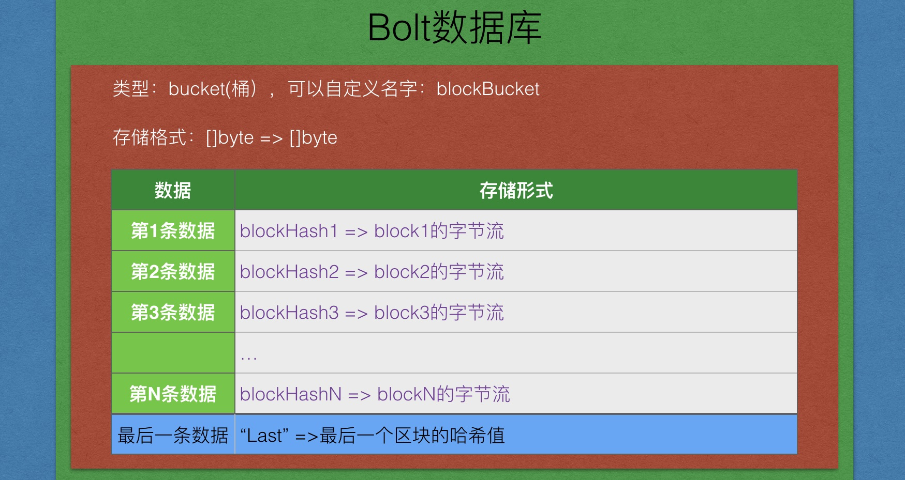
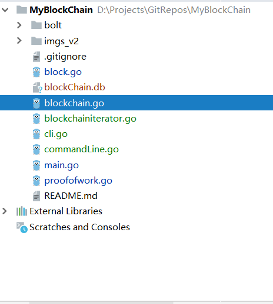
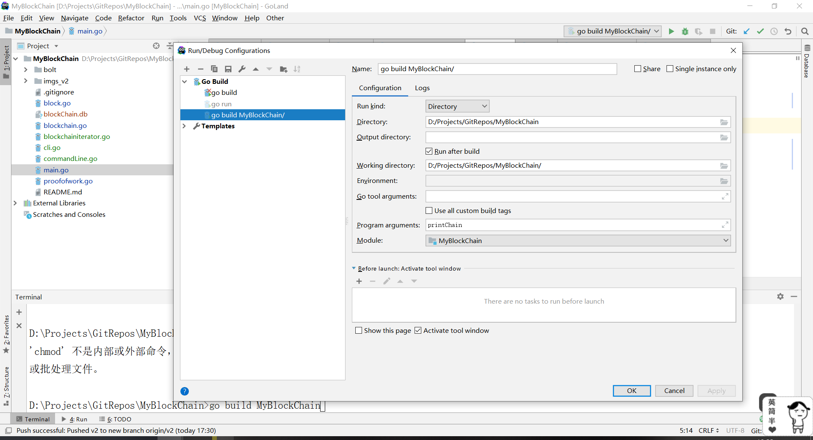

# 从0到1构建一条区块链----v3.0

## v2版本存在的问题

1. 区块只存于本地内存，而并未持久化
2. 添加区块只在main函数中实现

## v3实现思路

1. 引入boltdb数据库
2. BlockChain结构重构
3. NewBlockChain重构
4. AddBlock重构
5. 区块遍历的实现
6. 添加命令行操作

## 具体实现

### boltdb



### 最终目录结构



### 重构BlockChain结构体blockchain.go

```go
//4. 引入区块链
//2. BlockChain结构重写
//使用数据库代替数组
type BlockChain struct {
	//定一个区块链数组
	//blocks []*Block
	db *bolt.DB

	tail []byte //存储最后一个区块的哈希
}
```

### 重构NewBlockChain方法blockchain.go

```go
//只是返回区块链实例，不创建
func NewBlockChain() *BlockChain {
	//return &BlockChain{
	//	blocks: []*Block{genesisBlock},
	//}

	//最后一个区块的哈希， 从数据库中读出来的
	var lastHash []byte

	//1. 打开数据库
	db, err := bolt.Open(blockChainDb, 0600, nil)
	//defer db.Close()

	if err != nil {
		log.Panic("打开数据库失败！")
	}

	//将要操作数据库（改写）
	db.View(func(tx *bolt.Tx) error {
		//2. 找到抽屉bucket(如果没有，就创建）
		bucket := tx.Bucket([]byte(blockBucket))
		if bucket == nil {
			log.Panic(err)
		}

		lastHash = bucket.Get([]byte("LastHashKey"))

		return nil
	})

	return &BlockChain{db, lastHash}
}
```

### 重构区块链创建方法，实现数据库方式的创建blockchain.go

```go
const blockChainDb = "blockChain.db"
const blockBucket = "blockBucket"

//5. 定义一个区块链
func CreateBlockChain() *BlockChain {
	//return &BlockChain{
	//	blocks: []*Block{genesisBlock},
	//}

    /*
    1. 打开数据库(没有的话就创建)
    2. 找到抽屉（bucket），如果找到，就返回bucket，如果没有找到，我们要创建bucket，通过名字创建
        a. 找到了
            1. 通过"last"这个key找到我们最好一个区块的哈希。

        b. 没找到创建
            1. 创建bucket，通过名字
            2. 添加创世块数据
            3. 更新"last"这个key的value（创世块的哈希值）
    */

	//最后一个区块的哈希， 从数据库中读出来的
	var lastHash []byte

	//1. 打开数据库
	db, err := bolt.Open(blockChainDb, 0600, nil)
	//defer db.Close()

	if err != nil {
		log.Panic("打开数据库失败！")
	}

	//将要操作数据库（改写）
	db.Update(func(tx *bolt.Tx) error {
		//2. 找到抽屉bucket(如果没有，就创建）
		//没有抽屉，我们需要创建
		bucket, err := tx.CreateBucket([]byte(blockBucket))
		if err != nil {
			log.Panic("创建bucket(b1)失败")
		}

		//创建一个创世块，并作为第一个区块添加到区块链中
		genesisBlock := GenesisBlock()

		//3. 写数据
		//hash作为key， block的字节流作为value，尚未实现
		bucket.Put(genesisBlock.Hash, genesisBlock.Serialize())
		bucket.Put([]byte("LastHashKey"), genesisBlock.Hash)
		lastHash = genesisBlock.Hash

		return nil
	})

	return &BlockChain{db, lastHash}
}
```


### 增加区块序列化与反序列化方法block.go（gob实现）

```go
//序列化
func (block *Block) Serialize() []byte {
	var buffer bytes.Buffer

	//- 使用gob进行序列化（编码）得到字节流
	//1. 定义一个编码器
	//2. 使用编码器进行编码
	encoder := gob.NewEncoder(&buffer)
	err := encoder.Encode(&block)
	if err != nil {
		log.Panic("编码出错!")
	}

	//fmt.Printf("编码后的小明：%v\n", buffer.Bytes())

	return buffer.Bytes()
}

//反序列化
func Deserialize(data []byte) Block {

	decoder := gob.NewDecoder(bytes.NewReader(data))

	var block Block
	//2. 使用解码器进行解码
	err := decoder.Decode(&block)
	if err != nil {
		log.Panic("解码出错!", err)
	}

	return block
}
```


### 重构AddBlock方法blockchain.go

```go
//5. 添加区块
func (bc *BlockChain) AddBlock(data string) {
	//如何获取前区块的哈希呢？？
	db := bc.db         //区块链数据库
	lastHash := bc.tail //最后一个区块的哈希

	db.Update(func(tx *bolt.Tx) error {

		//完成数据添加
		bucket := tx.Bucket([]byte(blockBucket))
		if bucket == nil {
			log.Panic("bucket 不应该为空，请检查!")
		}

		//a. 创建新的区块
		block := NewBlock(data, lastHash)

		//b. 添加到区块链db中
		//hash作为key， block的字节流作为value，尚未实现
		bucket.Put(block.Hash, block.Serialize())
		bucket.Put([]byte("LastHashKey"), block.Hash)

		//c. 更新一下内存中的区块链，指的是把最后的小尾巴tail更新一下
		bc.tail = block.Hash

		return nil
	})
}
```

### 增加打印区块链的函数blockchain.go

```go
func (bc *BlockChain) Printchain() {

	blockHeight := 0
	bc.db.View(func(tx *bolt.Tx) error {
		// Assume bucket exists and has keys
		b := tx.Bucket([]byte("blockBucket"))

		//从第一个key-> value 进行遍历，到最后一个固定的key时直接返回
		b.ForEach(func(k, v []byte) error {
			if bytes.Equal(k, []byte("LastHashKey")) {
				return nil
			}

			block := Deserialize(v)
			//fmt.Printf("key=%x, value=%s\n", k, v)
			fmt.Printf("=============== 区块高度: %d ==============\n", blockHeight)
			blockHeight++
			fmt.Printf("版本号: %d\n", block.Version)
			fmt.Printf("前区块哈希值: %x\n", block.PrevHash)
			fmt.Printf("梅克尔根: %x\n", block.MerkelRoot)
			fmt.Printf("时间戳: %d\n", block.TimeStamp)
			fmt.Printf("难度值(随便写的）: %d\n", block.Difficulty)
			fmt.Printf("随机数 : %d\n", block.Nonce)
			fmt.Printf("当前区块哈希值: %x\n", block.Hash)
			fmt.Printf("区块数据 :%s\n", block.Data)
			return nil
		})
		return nil
	})
}
```

### 区块遍历的实现--迭代器blockchainiterator.go

#### 定义区块链迭代器结构体

```go
type BlockChainIterator struct {
	db *bolt.DB
	//游标，用于不断索引
	currentHashPointer []byte
}
```

#### 定义迭代器New函数

```go
func (bc *BlockChain) NewIterator() *BlockChainIterator {
	return &BlockChainIterator{
		bc.db,
		//最初指向区块链的最后一个区块，随着Next的调用，不断变化
		bc.tail,
	}
}
```

#### 定义Next函数

```go
//迭代器是属于区块链的
//Next方式是属于迭代器的
//1. 返回当前的区块
//2. 指针前移
func (it *BlockChainIterator) Next() *Block {
	var block Block
	it.db.View(func(tx *bolt.Tx) error {
		bucket := tx.Bucket([]byte(blockBucket))
		if bucket == nil {
			log.Panic("迭代器遍历时bucket不应该为空，请检查!")
		}

		blockTmp := bucket.Get(it.currentHashPointer)
		//解码动作
		block = Deserialize(blockTmp)
		//游标哈希左移
		it.currentHashPointer = block.PrevHash

		return nil
	})

	return &block
}
```

### 命令行模式实现cli.go

#### Cli结构体（仅做逻辑控制）

```go
type CLI struct {
	//bc *BlockChain
}
```

#### 命令行使用指南

```go
const Usage = `
	createBlockChain 地址     "创建区块链"
	addBlock --data DATA     "添加区块"
	printChain               "正向打印区块链"
	printChainR              "反向打印区块链"
`
```

#### 具体实现函数

```go
//接受参数的动作，我们放到一个函数中
func (cli *CLI) Run() {

	//./block printChain
	//./block addBlock --data "HelloWorld"
	//1. 得到所有的命令
	args := os.Args
	if len(args) < 2 {
		fmt.Printf(Usage)
		return
	}

	//2. 分析命令
	cmd := args[1]
	switch cmd {
	case "createBlockChain":
		fmt.Printf("创建区块链!\n")
		address := os.Args[2]
		cli.CreateBlockChain(address)
	case "addBlock":
		//3. 执行相应动作
		fmt.Printf("添加区块\n")

		//确保命令有效
		if len(args) == 4 && args[2] == "--data" {
			//获取命令的数据
			//a. 获取数据
			data := args[3]
			//b. 使用bc添加区块AddBlock
			cli.AddBlock(data)
		} else {
			fmt.Printf("添加区块参数使用不当，请检查")
			fmt.Printf(Usage)
		}
	case "printChain":
		fmt.Printf("正向打印区块\n")
		cli.PrinBlockChain()
	case "printChainR":
		fmt.Printf("反向打印区块\n")
		cli.PrinBlockChainReverse()
	default:
		fmt.Printf("无效的命令，请检查!\n")
		fmt.Printf(Usage)
	}
}
```

### commandLine.go的实现（真正意义上的命令行代码实现）commandLine.go

```go
func (cli *CLI) CreateBlockChain(address string) {
	bc := CreateBlockChain()

	if bc == nil {
		return
	}

	defer bc.db.Close()
}

func (cli *CLI) AddBlock(data string) {
	bc := NewBlockChain()

	if bc == nil {
		return
	}

	defer bc.db.Close()

	bc.AddBlock(data)
	fmt.Printf("添加区块成功！\n")
}

//正向打印
func (cli *CLI) PrinBlockChain() {
	bc := NewBlockChain()

	if bc == nil {
		return
	}

	defer bc.db.Close()
	bc.Printchain()
	fmt.Printf("打印区块链完成\n")
}

//反向打印
func (cli *CLI) PrinBlockChainReverse() {
	bc := NewBlockChain()

	if bc == nil {
		return
	}

	defer bc.db.Close()

	//创建迭代器
	it := bc.NewIterator()

	//调用迭代器，返回我们的每一个区块数据
	for {
		//返回区块，左移
		block := it.Next()

		fmt.Printf("===========================\n\n")
		fmt.Printf("版本号: %d\n", block.Version)
		fmt.Printf("前区块哈希值: %x\n", block.PrevHash)
		fmt.Printf("梅克尔根: %x\n", block.MerkelRoot)
		fmt.Printf("时间戳: %d\n", block.TimeStamp)
		fmt.Printf("难度值: %d\n", block.Difficulty)
		fmt.Printf("随机数 : %d\n", block.Nonce)
		fmt.Printf("当前区块哈希值: %x\n", block.Hash)
		fmt.Printf("区块数据 :%s\n", block.Data)

		if len(block.PrevHash) == 0 {
			fmt.Printf("区块链遍历结束！")
			break
		}
	}
}

```

### v3版本完成，进行测试

#### main.go

```go
func main() {
	cli := CLI{}
	cli.Run()
}
```

#### GoLand实现需要使用go build（右键项目运行可以看到）



#### 测试createBlockChain

```shell
创建区块链!
开始挖矿...
挖矿成功！hash : 0a3150d7305725048de23a059b516c9c02ca39a5fce7c0000238d30cb6295464, nonce : 10
```

#### 测试addBlock

```shell
添加区块
开始挖矿...
挖矿成功！hash : 0e31f5e9f084a006ec9a8051bb0c19aec2a3be2894989cd404a5e0c055e44984, nonce : 4
添加区块成功！
```

#### 测试printChain

```shell
正向打印区块
=============== 区块高度: 0 ==============
版本号: 0
前区块哈希值:
梅克尔根:
时间戳: 1551871445
难度值(随便写的）: 0
随机数 : 10
当前区块哈希值: 0a3150d7305725048de23a059b516c9c02ca39a5fce7c0000238d30cb6295464
区块数据 :I'm genesis!
=============== 区块高度: 1 ==============
版本号: 0
前区块哈希值: 0a3150d7305725048de23a059b516c9c02ca39a5fce7c0000238d30cb6295464
梅克尔根:
时间戳: 1551871499
难度值(随便写的）: 0
随机数 : 4
当前区块哈希值: 0e31f5e9f084a006ec9a8051bb0c19aec2a3be2894989cd404a5e0c055e44984
区块数据 :HelloWorld
打印区块链完成
```

#### 测试printChainR

```shell
反向打印区块
===========================

版本号: 0
前区块哈希值: 0a3150d7305725048de23a059b516c9c02ca39a5fce7c0000238d30cb6295464
梅克尔根:
时间戳: 1551871499
难度值: 0
随机数 : 4
当前区块哈希值: 0e31f5e9f084a006ec9a8051bb0c19aec2a3be2894989cd404a5e0c055e44984
区块数据 :HelloWorld
===========================

版本号: 0
前区块哈希值:
梅克尔根:
时间戳: 1551871445
难度值: 0
随机数 : 10
当前区块哈希值: 0a3150d7305725048de23a059b516c9c02ca39a5fce7c0000238d30cb6295464
区块数据 :I'm genesis!
区块链遍历结束！
```

